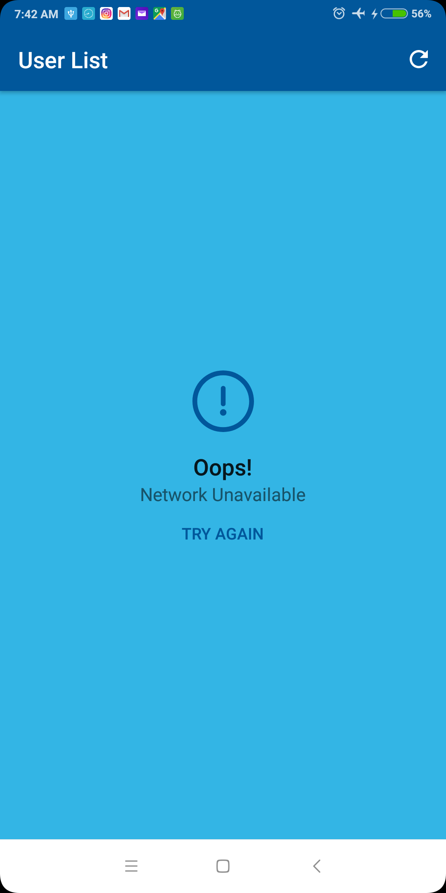
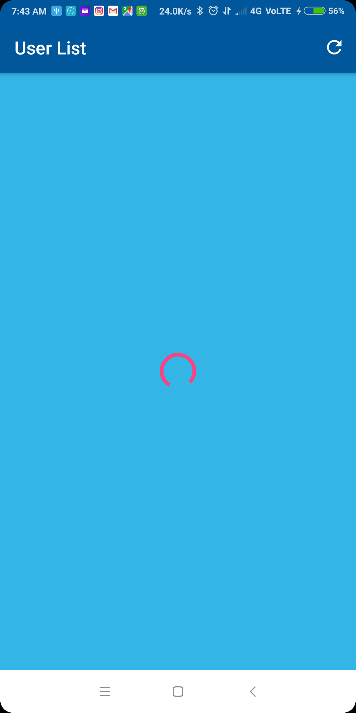
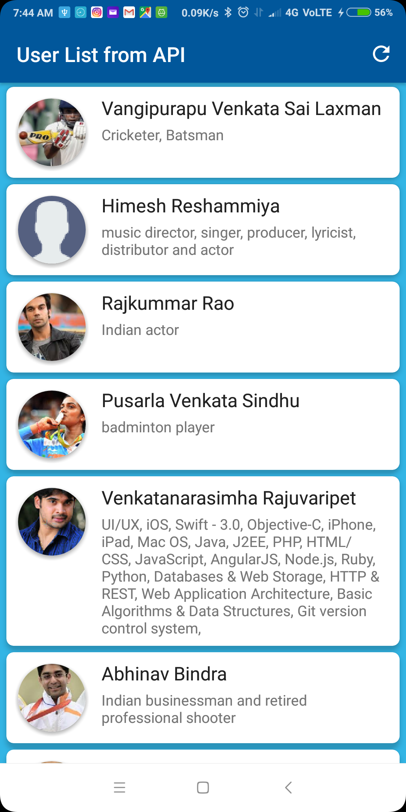
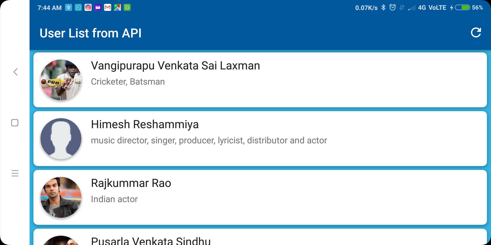

# UserList
This is a simple project where a list of users is fetched from the GET API given by Neva Innovation Labs.
The app stores the data to the local Database and is displayed from Database when the app is opened next time.
Users can try again when the network isn't available and can refresh the data when viewing list from local Database to store the new data locally.

## Screenshots :

  
  
  

  
  

